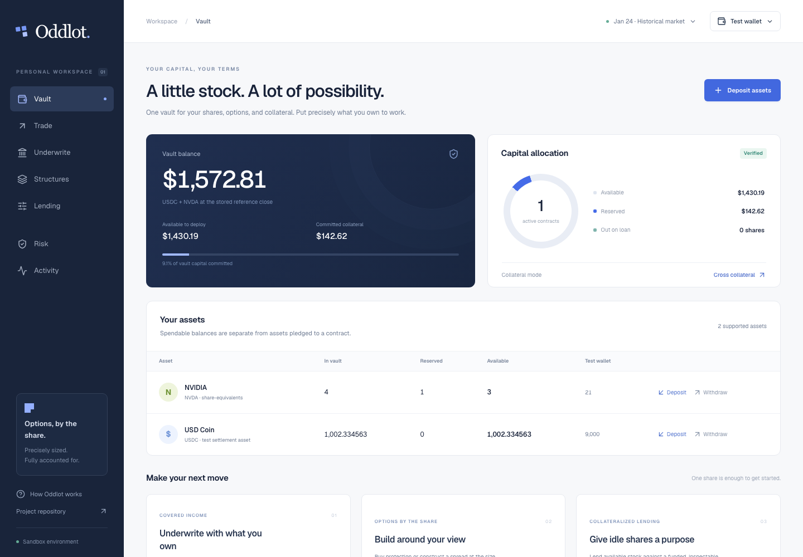

# Parcel

**Options, by the share.**

[](https://github.com/nichar3232/parcel/actions/workflows/ci.yml)

A unified equity workspace for granular options, covered underwriting, stock lending, protected shorts and structured contracts. Size exposure in share-equivalents, including fractional quantities to six decimals; one share is a denomination, not a minimum lot. A contract must have a nonzero payable obligation.

Parcel is a working **private test-asset product**. The same-origin Node API supports a persistent keyless sandbox and **Parcel program execution on a pinned private Solana validator or on devnet**. In either onchain mode, SPL test tokens back the vault and the program independently executes transfers, option deliveries, lending, protected shorts and cross collateral; SQLite indexes confirmed results. Both modes use funded test counterparties and historical prices. This is not a live brokerage or a source of external liquidity. The original Strata spread desk remains at `/legacy`.



## Start

```sh
git clone https://github.com/nichar3232/parcel.git
cd parcel
npm ci --ignore-scripts
npm run build
npm run demo
```

Use Node 22.23.2 from `.nvmrc`. Open `http://localhost:3025`. This single server serves the frontend **and** API. The complete vault workflow needs no keys. State persists in `.state/strata.sqlite`; the retained filename keeps deployed data compatible. Read [development setup](docs/DEVELOPMENT.md) before changing environment or hosting.

## What works

- **Portfolio:** holdings, a persistent PreStocks watchlist, and activity. Open contracts are marked to the same model the desk quotes with, and the combined payoff of the whole book is drawn across the price range.
- **Vault:** deposit/withdraw test USDC and NVDA from the app bar; inspect available, reserved and lent assets. Pledged assets cannot be withdrawn, sold or lent again.
- **Live marks:** a mark engine polls Pyth and Coinbase and walks anything with no fresh observation forward from its last real price. Every mark carries the source that produced it, and the desk shows it. See [pricing](#pricing-and-release-boundaries).
- **Options chain:** browse calls and puts by strike, daily or hourly expiry, and fractional exposure. Model buy/write indications show physical backing before a funded quote.
- **Sizing:** direct share-equivalents, premium budgets, and dollar sensitivity per one-cent reference move; exercise funding stays explicit.
- **Basic / Advanced:** Basic asks which way you think it goes and sizes it. Advanced adds the leg editor, ratios, settlement, the full Greeks, the options chain and the value surface — what the position marks at on every day between now and expiry.
- **Options:** fractional calls/puts, physical assignment, server-issued 30-second quotes, priced close-out and atomic expiry settlement.
- **Underwriting:** covered calls lock shares; cash-secured puts lock strike cash. Counterparty obligations are also reserved.
- **PreStocks:** the Portfolio watchlist reads the complete publisher catalog, including mark and token price, valuations, supply, description, logo and source link. Its reviewed mints are read from mainnet before the desk ever offers an escrow workflow. Publisher marks are informational; no sponsor token moves on chain. See [PreStocks](docs/PREIPO.md).
- **Structures:** call/put spreads, straddles, strangles, iron condors, butterflies, collars, and capped dividend-reference contracts. Edit up to four legs and whole-number ratios. Add fixed-payout boxes, capped quadratic/exponential contracts, dividend floors, ranges and convexity.
- **Money market:** supply and borrow rates are derived from each reserve's utilisation on the two-slope curve, with per-asset loan-to-value and liquidation thresholds, one health factor over the whole book, and the liquidation price of an open short.
- **Borrow against stock:** pledge tokenized stock and draw USDC from its pool at a variable or fixed rate. The pledge stays in the vault, reserved, up to the asset's loan-to-value. A fixed loan locks the pool's rate and repays itself at term; a variable loan is repriced every session off the same curve and runs until repaid. A pledge that stops covering the debt at the liquidation threshold is sold up at that session's mark.
- **Stock lending:** the test borrower sells the stock, buys market-backed call protection, and escrows the capped repurchase amount plus term interest. Recall repurchases principal and credits accrued interest; the market cannot reuse pledged protection stock.
- **Long/short stock:** spot longs are cash funded. Shorts pair the borrow with a covered protective call, and reserve the maximum repurchase cost plus term interest.
- **Cross collateral:** net matching settlement obligations and reuse earlier guaranteed cash receipts for later obligations. Reserve every intermediate cash deficit; unrelated directional positions and outside lenders receive no correlation credit. Isolated mode remains available.
- **Activity:** persistent receipts, transaction history, export, stale-tab protection and safe HTTP retries, including pending-action recovery after reload.

Start by depositing one NVDA share, choose **Underwrite → Covered call**, review the actual premium and reserve, and confirm. Use **Market controls** to advance historical sessions; due positions settle at their exact stored expiry observation. The UI does not fabricate balances after an API failure.

## Agent access

Parcel's MCP server (`mcp/tools.ts`) lets Claude, or any MCP client, use the vault through the same HTTP API as the desk, so accounting, risk checks and signing stay on the server. It exposes quotes, options (including spreads and curves), stock, lending, protected shorts, collateral mode and the market replay. Cash borrowing is sandbox-only, and chain mode refuses it.

**Connect from the desk.** Open **Agents** in the desk's top bar and create a key. The key acts for that vault only; it is shown once and can be revoked there. The dialog gives the command:

```sh
claude mcp add --transport http parcel <desk-url>/mcp --header "Authorization: Bearer <key>"
```

The app serves MCP itself at `/mcp` (stateless Streamable HTTP), so any MCP client works with that URL and header, and nothing needs installing. Requests made with a key need no CSRF token because they carry no browser cookie. Every action a key places is marked as the agent's and labelled **Agent** in Activity. Keys cannot create or revoke keys.

**Or run it locally** over stdio from a checkout: `.mcp.json` registers `mcp/parcel.ts`, which reads `PARCEL_URL` and `PARCEL_AGENT_KEY` (or `PARCEL_SESSION`, a browser's `strata_session` cookie).

On devnet, every agent action returns its signature and an Explorer link. An agent placed these: [deposit](https://explorer.solana.com/tx/4C6a3zaujC6sZ5N3tjNDU8fYjkLLhWecnbei3YUUuqEWgPbFJqwNEvu6iD4kx4dVV8nv6dmRexxhh5yKnfxEmqPx?cluster=devnet), [stock purchase](https://explorer.solana.com/tx/5fRoLSmoXDXu77iiMMe6JVH7T5gq9ZCxT1cGyya4ooyCXLYexefuGvwQtHhdKP978v6Dq3PZSwgVvHeajZoahuS5?cluster=devnet), [call option](https://explorer.solana.com/tx/62ZVnc9ot1pXPAGLsNU7MdPycWowZsmw7KtKXhSLmXRDJPfd1WqRysxXfTLoM1w3UyXW83hy7PvCnYT1ht974S9N?cluster=devnet). A request whose response is lost is saved and resent with the same idempotency key, so it executes exactly once.

## Code organization

| Area | Responsibility |
|---|---|
| `app/tokens.css` | The palette. Every colour in the product resolves through it |
| `app/page.tsx`, `components/brand/` | Landing page and the payoff viewer it opens on |
| `app/desk.css`, `components/parcel/` | Workspace, views, contract editor, charts and the value surface |
| `hooks/parcel/use-vault.ts` | Same-origin requests, revisions, recovery and UI state |
| `hooks/parcel/use-marks.ts` | The live mark feed, as the desk sees it |
| `server/prices/` | Mark engine, its two sources, and the simulated maker |
| `lib/parcel/lending.ts` | Reserve parameters, the rate curve and the health factor |
| `lib/parcel/` | Types, six-decimal arithmetic, Greeks, templates and collateral envelopes |
| `server/parcel/service.ts` | Session ownership, quote lifecycle, atomic actions and receipts |
| `server/parcel/ledger.ts` | Asset transfers, loans, protected shorts and net expiry settlement |
| `server/db/002-vaults.sql`, `003-vault-chain.sql` | Vaults, quotes and recoverable onchain operations |
| `server/parcel/chain/`, `programs/parcel/` | Durable execution coordinator, binary codec and new vault program |
| `server/solana/network.ts` | The genesis pin: which ledgers are accepted, and the refusal of mainnet |
| `app/legacy/`, `server/domain/`, `server/solana/` | Retained historical desk and durable Solana execution |
| `programs/strata/` | Audited original Anchor escrow program |
| `tests/`, `.github/workflows/` | Domain/API regression tests and real-backend browser CI |
| `ops/` | VPS deployment, backup, rollback and restart verification |

## Verify

```sh
npm run check:repo
npm run check
npx playwright install chromium
npm run test:e2e
```

CI runs this flow on Linux from a clean checkout. The suite is 129 application tests and 43 browser journeys. They cover accounting conservation, invalid collateral withdrawal, duplicate and expired quotes, wrong-session access, stale revisions, physical assignment, cross-collateral hedge removal, stock loans, cash loans against pledged stock including term settlement and liquidation, capped shorts, dividends, browser recovery, and that no view scrolls sideways on a phone. The 0.4 release audit recorded 65 application tests, 25 browser journeys, 6 native Rust tests, a 19-action confirmed Parcel chain lifecycle and 9 rejected adversarial program transactions. Actual Solana program verification remains an explicit operator command; it runs against the pinned private validator or devnet, and refuses any other ledger. See the [findings and verification evidence](docs/audit/2026-09-15-release/REPORT.md).

## Pricing and release boundaries

**Live marks are display and indicative pricing only.** The vault's own accounting stays on the stored session clock, so a contract's premium and its settlement can be reproduced from the ledger. The live feed drives the tape, the markets tables, the pre-IPO valuations and the header.

Marks come from Pyth first and Coinbase second, and anything with no fresh observation is walked forward from its last real price by a geometric Brownian motion. Pyth is the only one of the two that publishes US equities, and its price endpoint now requires a key: without `PYTH_API_KEY` it resolves its feed ids, takes one 401 and stands down, which leaves NVDA and every sponsor token on the walk. Coinbase needs no key, so the crypto collateral is genuinely live out of the box. Every mark carries its source and the time of its last real observation, and the UI shows both — a simulated tick is never presented as a market price.

Sponsor tokens are mock tokens pegged to whatever their provider publishes, re-anchored whenever that mark moves more than a per cent. The simulated maker prints two or three fills a second across the book, minting on a buy and burning on a sell, which is what moves pool utilisation and therefore the lending rates.

Hourly test-clock ticks carry the committed daily close forward; they are not historical intraday data. NVDA closes are retained historical observations from January–April 2025. Options use an explicitly labeled Black–Scholes test model with 45% volatility and 4% annual interest; dividend-reference pricing uses an illustrative 80% input. These are not live quotes or historical option premiums. Dollar theta scales with quantity; shrinking a contract does not change percentage decay per share.

Dividend contracts reference the issuer's declared $0.01 dividend for the March 12, 2025 record-date event, payable April 2. They do not transfer dividend ownership or model an xStock multiplier as a cash payment. See [product rules and sources](docs/PRODUCT.md).

Sandbox rules are backend-enforced. Configured onchain vaults execute the matching Parcel program with actual SPL escrow and server-held test signers, on either the pinned private validator or devnet. Mainnet is refused by the genesis pin and cannot be configured. Production still requires wallet authentication and client signing, external liquidity, live pricing/oracle feeds, issuer/corporate-action handling and independent program review. Onchain mode limits each vault to 64 active positions for account and transaction compute bounds; sandbox mode supports 500. The recorded lifecycle and adversarial evidence is local-validator evidence. The program is **also deployed on devnet** as `FwEY5cM9vP31LwywoJu1XWQ1nvBeNh2aMsVVpbYayRvC`, with its own operator and six-decimal test mints (it replaces `A4NTJ45B…`, whose operator key was lost), where the same 19-action lifecycle and all 14 adversarial rejections are confirmed. Devnet needs a dedicated `SOLANA_RPC_URL`: the public endpoint rate limits well below what a complete run, or a desk serving several readers, requires. The prior Bellwether repository has been retired; its history is preserved here as this repository's root commit `ed73929`.

The [original engineering audit](docs/audit/REPORT.md) records the legacy execution review and dependency findings. Two moderate entries remain in an unused upstream streaming parser; there are no critical/high findings in that retained audit. The original audited program artifacts and evidence are preserved. No private keys, runtime databases or real `.env` files belong in this repository.

## Review the current product

The [product-suite verification](docs/audit/2026-09-15-product-suite/REPORT.md) covers this extension. The [Parcel submission](submission/ENTRY.md), [demo script](submission/DEMO_SCRIPT.md), and [narrated video](submission/parcel-demo.mp4) remain the prior 0.3 release materials; video/live-provider work is outside this product extension. Previous Bellwether/Strata materials are retained in `submission/legacy/` as historical evidence. A fresh keyless clone starts in sandbox mode. See [Parcel localnet setup](docs/PARCEL_CHAIN.md) to enable the new program; execution never silently falls back to SQLite.
