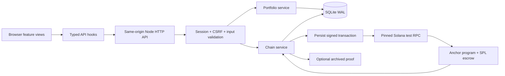

# Oddlot architecture

The new vault engine is specified in [PRODUCT.md](PRODUCT.md) and [DEVELOPMENT.md](DEVELOPMENT.md). It adds owner-scoped `vault_accounts` and `vault_quotes`, a settlement collateral engine with cross-contract rounding protection in `lib/oddlot`, and atomic actions in `server/oddlot`. The browser delegates all execution to that service. New vault custody is backend sandbox accounting.

## Vault boundaries

Views send intent, never replacement balances. `lib/client/api.ts` owns transport; `lib/client/pending-vault.ts` stores only a tab-local pending intent and idempotency key. `useVault` keeps the authoritative snapshot and accepts account changes only through the latest session refresh. A delayed response from another session cannot update the current view. A transport failure, server error, or unreadable response is ambiguous: the original mutation remains recoverable after reload, and new mutations are blocked until it resolves. Session storage contains no session cookie or full CSRF token.

`lib/oddlot/validation.ts` is used before rendering option math and again at the server boundary. Quote responses are discarded when the draft changes. Quotes bind the stored account revision; reviewed stock/lending actions also preserve their original revision and displayed price. SQLite infrastructure failures remain server errors; rejected product rules return a conflict.

| Vault route | Input and result |
|---|---|
| `GET /api/vault` | Session-owned book, revision, market and collateral |
| `POST /api/vault/quote` | `{revision, terms}` → owner-bound, expiring quote |
| `POST /api/vault/actions` | `{revision, action}` → committed snapshot and durable receipt |

The retained Strata/Solana execution architecture below remains available at `/legacy`; its program does not implement the new vault rules.

# Runtime and trust boundaries

## Portfolio transactions

The browser never sends a replacement book. It submits an action, reviewed revision and idempotency key. `BEGIN IMMEDIATE` serializes mutations. A matching receipt returns the original result; a reused key with different input or stale revision returns 409. The server generates RFQ identity, uses its own clock, validates shared terms and reads settlement prices from the retained dataset. Cash movement uses integer base units; conservation is checked before commit.

SQLite contains sessions, portfolios, receipts, chain positions, operations and audit events. Session tokens are random 256-bit values, stored only as SHA-256 hashes. Cookies are HttpOnly/SameSite=Strict, with Secure enabled for HTTPS. Session life is 30 days. Browser possession of the cookie grants access to that isolated no-value demo session; this is not an identity/KYC system.

## Chain transaction state machine

`prepared → submitted → confirmed | failed`

Preparation verifies the configured genesis hash, executable program, six-decimal mint authority and test fee balance. Only explicit localnet/devnet configuration is accepted; mainnet genesis is rejected. Localnet requires loopback RPC. Instructions are simulated before persistence to reject known invalid actions without creating an ambiguous operation.

Before any send, the database commits immutable contract identity, signature, serialized signed transaction, last valid block height and operation key. One unresolved operation is permitted per contract. Same-session preparation is serialized; database uniqueness also prevents duplicate cross-process insertion. No RPC call runs inside a database write transaction.

A transport failure does not prove a transaction failed. Reconciliation queries signature history and, while valid, re-broadcasts the same bytes. Only an explicit on-chain error or finalized expiration without a signature marks failure. Confirmed signatures are stored before optional proof retrieval. Reads fetch offer, vault and the Clock sysvar at one RPC context slot. The UI uses this chain time for deadlines; it never enables settlement using wall time. A delayed read cannot replace a newer observation or erase transaction evidence.

Every browser session derives independent holder and maker **test** keys with HMAC-SHA256 from the dedicated authority secret and session ID. Only the dedicated no-value authority stays on disk. A funded offer atomically creates associated token accounts as needed, mints disclosed test capital, funds account rent, creates the committed market and deposits full reserve. This is demo provisioning, not live liquidity.

## HTTP contract

| Route | Purpose |
|---|---|
| `GET /api/session` | Start/resume session, book, revision, CSRF and server time |
| `GET /api/portfolio` | Authoritative book |
| `POST /api/portfolio/actions` | `{revision, action}`; CSRF and Idempotency-Key required |
| `GET /api/chain/positions` | Session-owned contract list |
| `GET /api/chain/positions/:id` | Reconcile already-authorized operation and read chain |
| `POST /api/chain/action` | fund/accept/cancel/settle/claim-holder/claim-maker |
| `GET /api/evidence` | Saved adversarial verification report |
| `GET /api/chain/tx/:signature` | Live or explicitly archived transaction proof |
| `GET /api/health` | HTTP/database liveness plus detailed chain status |
| `GET /api/ready` | 200 only when database and configured chain are ready |

Mutation bodies are JSON and at most 16 KiB. Cross-site origins and incorrect CSRF tokens are rejected. Errors use `{error, code}`. Static files support GET/HEAD, ETags, video byte ranges and rooted path checks. The long-running contract verifier is a CLI, not a public mutation route.

## Contract review

Anchor verifies signer identity, mint/token-program ownership, vault authority, party relationships, market identity and PDA seeds. Funded terms are immutable. Acceptance must match every serialized term and precede the quote deadline. Reserve uses checked u128 multiplication and one downward division. Payout cannot exceed reserve. Missing data retains escrow; either named party claims its entitlement once. The two claims consume exactly the original reserve.

The market authority is a trusted test oracle. Dataset/feed identity is stored, but this is not an external oracle proof. Market/offer accounts are retained, so rent is not reclaimed. Unsolicited token donations beyond the contracted reserve have no withdrawal path. There is no contractual permanent-outage refund, production corporate-action adjustment, margin netting or lending execution. These are explicit product/release boundaries.
