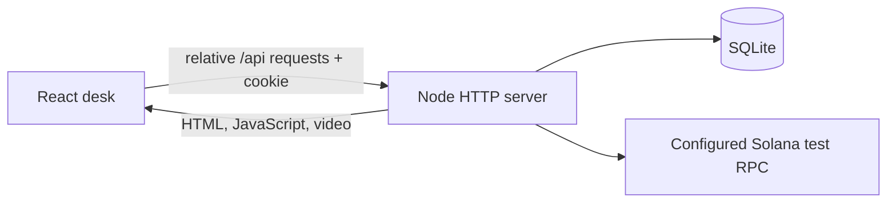

# Development and integration

## One application, one origin

The production entrypoint is `server/index.ts`. It serves both the Vite-built frontend in `dist/client` and the `/api` routes. Browser hooks use relative URLs and same-origin cookies. The backend owns sessions, portfolio revisions, accounting, historical settlement inputs and Solana execution.



## Clean checkout

```sh
npm ci --ignore-scripts
npm run build
npm run demo
```

Use Node 22.23.2 from `.nvmrc`. Open `http://localhost:3025`. `npm run demo` explicitly disables chain execution, while the complete historical practice ledger remains available. No account, wallet, external API or secret is required. Stop with Ctrl+C; restarting with the same state directory preserves portfolios and receipts.

For UI development, keep that backend running and start `npm run dev` in a second terminal. Open the URL Vite prints. Its `/api` proxy targets `http://localhost:3025`, keeping cookies on the frontend origin. The backend still needs to run. Changes to backend source require a backend restart.

## Environment

The server reads process environment variables. `.env.example` documents them; `npm start` does **not** automatically load a `.env` file. Use inline environment variables locally, or Node's explicit loader:

```sh
cp .env.example .env
node --env-file=.env --import tsx server/index.ts
```

On the VPS, systemd loads the protected `EnvironmentFile`; see `ops/README.md`.

| Variable | Default | Meaning |
|---|---|---|
| `PORT` | `3025` | UI and API listen together |
| `HOST` | `0.0.0.0` | Listener address |
| `STRATA_STATE_DIR` | `.state` | SQLite and test configuration directory |
| `STRATA_PUBLIC_DIR` | `dist/client` | Built public assets |
| `CHAIN_ENABLED` | enabled unless `false` | Set `false` for keyless historical demo |
| `SOLANA_NETWORK` | `localnet` | Explicit `localnet` or `devnet` |
| `SOLANA_RPC_URL` | `http://127.0.0.1:8899` | Pinned test RPC; localnet must be loopback |
| `SOLANA_GENESIS_HASH` | empty | Required chain identity pin before execution |
| `REPLAY_EXPIRY_SECONDS` | `90` | Actual-chain demo observation delay |
| `COOKIE_SECURE` | `false` | Set `true` behind HTTPS |
| `ALLOWED_ORIGINS` | empty | Optional comma-separated trusted mutation origins |
| `SITE_ORIGIN` | private host fallback | Build-time origin for social metadata |

Advanced dedicated deployments may configure `STRATA_PROGRAM_ID` and `STRATA_AUTHORITY`; the compiled program constants and provisioned keys must agree. The existing VPS is already configured. Do not copy its keys into a clone.

## Request contract

`GET /api/session` starts or resumes the HttpOnly session and returns `{book, revision, csrf, serverTime, sessionExpiresAt}`. Mutations send the session cookie, `X-CSRF-Token`, `Idempotency-Key` and JSON. A practice action is `{revision, action}`; the server rejects stale revisions. An interrupted mutation must reuse the same key and body. Never send a replacement portfolio or generate a new transaction merely because an HTTP request timed out.

The route table and chain state machine are in [ARCHITECTURE.md](ARCHITECTURE.md); shared response types are in `lib/contracts/api.ts`. The three hooks in `hooks/desk/` are the integration point for views and dialogs.

## Verification and troubleshooting

`npm run check` performs typechecking, lint, unit/API tests and a production build. `npm run test:e2e` starts a fresh real backend on port 3027 and exercises UI actions against it. Use `E2E_BASE_URL` only to intentionally test an existing deployment. CI installs Chromium and runs this same flow on Linux.

- Empty or missing page: run `npm run build`; a backend without `dist/client` cannot serve the desk.
- Connection error: start the backend and confirm the dev proxy targets its port. Do not bypass the API with local browser balances.
- HTTP 409: refresh the authoritative portfolio; another tab may have changed the revision.
- Chain unavailable in keyless mode: expected. `GET /api/health` checks app/database liveness. `/api/ready` also requires the configured chain and returns 503 while chain execution is disabled.
- A static-only hosting deployment cannot run this backend. Keep UI and API together on the VPS, or provision an equivalent Node service with persistent storage.
