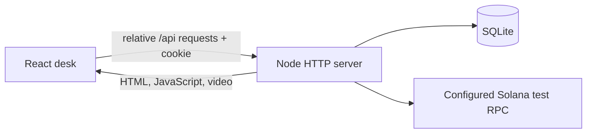

# Parcel development and integration

## One application, one origin

The production entrypoint is `server/index.ts`. It serves both the Vite-built frontend in `dist/client` and the `/api` routes. Browser hooks use relative URLs and same-origin cookies. The backend owns sessions, portfolio revisions, accounting, historical settlement inputs and Solana execution.



## Clean checkout

```sh
npm ci --ignore-scripts
npm run build
npm run demo
```

Use Node 22.23.2 from `.nvmrc`. Open `http://localhost:3025`. `npm run demo` explicitly disables chain execution, while the complete historical practice ledger remains available. No account, wallet, external API or secret is required. Stop with Ctrl+C; restarting with the same state directory preserves portfolios and receipts.

For UI development, keep that backend running and start `npm run dev` in a second terminal. Open the URL Vite prints. Its `/api` proxy targets `http://localhost:3025`, keeping cookies on the frontend origin. The backend still needs to run. Changes to backend source require a backend restart.

## Environment

The server reads process environment variables. `.env.example` documents them; `npm start` does **not** automatically load a `.env` file. Use inline environment variables locally, or Node's explicit loader:

```sh
cp .env.example .env
node --env-file=.env --import tsx server/index.ts
```

On the VPS, systemd loads the protected `EnvironmentFile`; see `ops/README.md`.

| Variable                | Default                         | Meaning                                                                                                                  |
| ----------------------- | ------------------------------- | ------------------------------------------------------------------------------------------------------------------------ |
| `PORT`                  | `3025`                          | UI and API listen together                                                                                               |
| `HOST`                  | `0.0.0.0`                       | Listener address                                                                                                         |
| `STRATA_STATE_DIR`      | `.state`                        | SQLite and test configuration directory                                                                                  |
| `STRATA_PUBLIC_DIR`     | `dist/client`                   | Built public assets                                                                                                      |
| `CHAIN_ENABLED`         | enabled unless `false`          | Set `false` for keyless historical demo                                                                                  |
| `SOLANA_NETWORK`        | `localnet`                      | Explicit `localnet` or `devnet`                                                                                          |
| `SOLANA_RPC_URL`        | `http://127.0.0.1:8899`         | Pinned test RPC; localnet must be loopback                                                                               |
| `SOLANA_GENESIS_HASH`   | empty                           | Required chain identity pin before execution                                                                             |
| `REPLAY_EXPIRY_SECONDS` | `90`                            | Actual-chain demo observation delay                                                                                      |
| `COOKIE_SECURE`         | `false`                         | Set `true` behind HTTPS                                                                                                  |
| `ALLOWED_ORIGINS`       | empty                           | Optional comma-separated trusted mutation origins                                                                        |
| `SITE_ORIGIN`           | private host fallback           | Build-time origin for social metadata                                                                                    |
| `MASSIVE_STOCKS_API_KEY` | empty                          | Server-only Massive market-data credential; required for listed-equity NBBO                                             |
| `MASSIVE_STOCKS_FEED`    | `realtime`                     | `realtime` or explicit `delayed`; delayed provenance remains visible in the API                                          |
| `MASSIVE_STOCKS_WS_URL`  | `wss://socket.massive.com/stocks` | Massive stock WebSocket endpoint; use the protected production value                                                     |
| `MARKET_DATA_REQUIRED`   | `false`                        | Set `true` in monitored deployments to make `/api/ready` require authenticated real-time listed-equity NBBO            |
| `PYTH_HERMES_URL`        | `https://pyth.dourolabs.app/hermes` | Authenticated Pyth oracle endpoint; its confidence interval is never treated as a bid/ask                            |
| `PYTH_API_KEY`           | empty                          | Optional server-only Pyth credential; oracle marks are not executable quotes                                             |
| `COINBASE_API_URL`       | `https://api.exchange.coinbase.com` | Read-only crypto venue price/BBO endpoint; it is a venue BBO, not cross-venue NBBO                                   |
| `XSTOCKS_API_URL`       | `https://api.xstocks.fi/api/v2` | Public issuer catalog and indicative quote API for the Solana xStocks watchlist                                          |
| `SUPERSTATE_API_URL`    | `https://api.superstate.com`    | Public Opening Bell registry and direct price API; only completed Solana equity deployments are shown                    |
| `ONDO_API_URL`          | `https://api.gm.ondo.finance`   | Ondo Stocks issuer API base URL; used only with `ONDO_API_KEY`                                                           |
| `ONDO_API_KEY`          | empty                           | Optional Ondo issuer credential. Without it the UI explicitly marks Ondo as not configured and shows no substitute quote |

Advanced dedicated deployments may configure `STRATA_PROGRAM_ID` and `STRATA_AUTHORITY`; the compiled program constants and provisioned keys must agree. The existing VPS is already configured. Do not copy its keys into a clone.

## Request contract

`GET /api/session` starts or resumes the HttpOnly session and returns `{book, revision, csrf, serverTime, sessionExpiresAt}`. Mutations send the session cookie, `X-CSRF-Token`, `Idempotency-Key` and JSON. A practice action is `{revision, action}`; the server rejects stale revisions. An interrupted mutation must reuse the same key and body. Never send a replacement portfolio or generate a new transaction merely because an HTTP request timed out.

The route table and chain state machine are in [ARCHITECTURE.md](ARCHITECTURE.md); shared response types are in `lib/contracts/api.ts`. The three hooks in `hooks/desk/` are the integration point for views and dialogs.

## Verification and troubleshooting

`npm run check` performs typechecking, lint, unit/API tests and a production build. `npm run test:e2e` starts a fresh real backend on port 3027 and exercises UI actions against it. Use `E2E_BASE_URL` only to intentionally test an existing deployment. CI installs Chromium and runs this same flow on Linux.

- Empty or missing page: run `npm run build`; a backend without `dist/client` cannot serve the desk.
- Connection error: start the backend and confirm the dev proxy targets its port. Do not bypass the API with local browser balances.
- HTTP 409: refresh the authoritative portfolio; another tab may have changed the revision.
- Chain unavailable in keyless mode: expected. `GET /api/health` checks app/database liveness and reports source-by-source market-data state. `/api/ready` also requires the configured chain and, when `MARKET_DATA_REQUIRED=true`, an authenticated real-time listed-equity NBBO stream.
- A static-only hosting deployment cannot run this backend. Keep UI and API together on the VPS, or provision an equivalent Node service with persistent storage.

## Parcel vault API

After `GET /api/session`, `GET /api/vault` returns the vault book, its independent revision, risk summary and the stored market session. `POST /api/vault/quote` accepts `{revision, terms}` and returns a 30-second owner-bound quote. `POST /api/vault/actions` accepts `{revision, action}`. All POST routes require the same cookie, `X-CSRF-Token` and `Idempotency-Key`. The quote cannot be reused under another key, account or revised portfolio.

`VaultAction` in `lib/parcel/types.ts` defines transfers, stock trades, quote execution, option close, margin policy, lend/recall, protected short/close and market advancement. The client never supplies a settlement price, reserve, loan interest amount, counterparty balance or replacement book. New routes share the same authentication and static-serving process as the original backend. `/legacy` serves the retained Strata desk with its original API and independent practice balances.

Migration `002-vaults.sql` adds accounts and quotes without rewriting old sessions or portfolios. Fresh and existing databases run both idempotent migrations on startup. The new client uses only relative API URLs. `npm run demo` enables the entire vault ledger with the separate chain service disabled; `/api/ready` can therefore return 503 while the keyless vault is fully operable. Production operator checks should inspect the returned chain reason as well as liveness.

## Recovering a vault mutation

The browser saves a pending mutation's original body and key in session storage before sending it. If both responses are lost, an HTTP 5xx arrives, or the response is unreadable, use **Resolve saved action**. The same intent/key survives a tab reload. Other mutations and quote requests stay blocked until it resolves. A definitive API rejection clears the pending intent. Storage must be available before the first mutation; the client fails closed if it cannot save recovery state. Do not clear browser data while an action is unresolved.

The September 15 [follow-up audit](audit/2026-09-15-review/REPORT.md) covers real HTTP guards, injected transaction failure, disk reopen, legacy database migration, fractional cross-contract rounding, invalid form inputs, delayed quotes, account changes, and interrupted responses.

## Current Parcel program integration

The keyless command still starts a sandbox. To execute the new vault program, configure the explicit Parcel program/mint variables described in [PARCEL_CHAIN.md](PARCEL_CHAIN.md). In that mode, `/api/ready` checks the Parcel program and test mints; `/api/vault` labels the mode `localnet` and includes the latest verified ledger, signature, slot and revision. `POST /api/vault/quote` also accepts `{revision, positionId}` for a reviewed option close. The final historical session offers `restart`; this restores test allocations only when all positions are flat and keeps revision and receipts.

## Product suite development

`npm run verify:parcel-suite` exercises curves, hourly settlement, calendar offsets, dividend structures and loans/shorts on the explicitly configured private validator. Add `-- --capacity` for 64 nonlinear positions and withdrawal of all free cash before multi-date settlement. Run `npm run verify:parcel-adversarial` for signed invalid instructions, including invalid curves. `npm run test:e2e` covers the same-origin sandbox UI, desktop/mobile chain selection and progressive controls. Routine screenshots now go to ignored `test-results/audit`, preserving dated release evidence.

For this source, use a separately deployed V2 program and a fresh state directory/session. Keep the old program, state and pending signed transactions with the old release until resolved. Do not point the new binary codec at V1 accounts. See `PARCEL_CHAIN.md`. No deployment of the always-on app or new live/demo provider is part of this extension.
